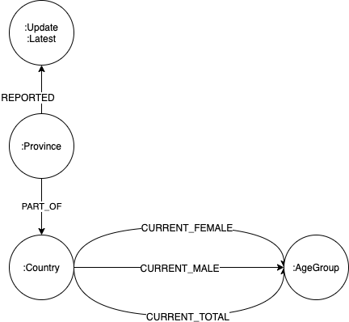

We build a knowledge graph on Covid-19 that integrates various public datasets.

- A publication data set on Covid-19 ([https://pages.semanticscholar.org/coronavirus-research)](https://pages.semanticscholar.org/coronavirus-research))
- Data on gene interaction and function from public genome databases (from [ENSEMBL](http://www.ensembl.org) and [NCBI Gene](https://www.ncbi.nlm.nih.gov/gene))
- Case reports from John Hopkins University ([https://github.com/CSSEGISandData/COVID-19](https://github.com/CSSEGISandData/COVID-19))
- Population data from the UN ([https://population.un.org/wpp/](https://population.un.org/wpp/))
- Patents related to Covid-19 ([https://about.lens.org/covid-19/](https://about.lens.org/covid-19/))

The graph is implemented in Neo4j, a public version is accessible at:

- https://covid.petesis.com:7473
- http://covid.petesis.com:7474/ (for Chrome/ium and other cases where there is a problem with SSL)
- user: public, password: corona

The schema of the graph can be seen, [here](https://www.yworks.com/yed-live/?file=https://gist.githubusercontent.com/yGuy/27c2412bbf0724464c396fe2dc2a6851/raw/1bbd411619478ba1d500cea079de4d25ce947707/CovidGraphSchemaCleaned). 

**Note: There is an issue with Chrome/Chromium and SSL. Use Firefox/Safari. We are working on a solution.**


## Contributors


 
**Martin Preusse** ([martinpreusse.com)](https://martinpreusse.com)), PhD in computational biology, Neo4j expert, Founder of [Kaiser & Preusse](https://kaiser-preusse.com).

 
 
 
**Sebastian Mueller** ([GitHub/yGuy](https://github.com/yguy)), working at [yWorks](https://yworks.com) on custom visualization solutions with [yFiles](https://www.yworks.com/yfiles). In this project, Sebastian is working on a prototype application for conveniently browsing the network of Covid19-related papers and publications.


**Tim Bleimehl** ([github/motey](https://github.com/motey)), working at [German Center for Diabetes Research](https://www.dzd-ev.de) as IT-cook-general.
In this project Tim is working on the ETL pipeline for the CORD-19 Dataset.


**Dr. Alexander Jarasch** is the head of Data and Knowledge management department at the German Center for Diabetes Research (DZD). His team supports scientists from basic research and and clinical research with IT solutions from data management to data analysis. New insights from diabetes research and its complications are stored in a knowledge graph connecting data from basic research, animal models and clinical trials.

**Darko Križić**, CTO ((PRODYNA)[https://www.prodyna.com/en/management])

**Juliana Zimmermann**


# 1. Case data

**Note: The description below only covers part of the graph (Johns Hopkins case data + UN population data). More description and docs will follow!**

A knowledge graph that integrates case numbers reported by John Hopkins University and population data from the UN. Work in progress, looking for more datasources, PR welcome!

The graph is available in a Neo4j Sandbox: https://10-0-1-172-33065.neo4jsandbox.com/browser/

**User:** public, **Password:** public

You can add it to Neo4j Desktop with the bolt URL, same user/password: `bolt://100.24.206.62:33064`

### Datamodel 


### Queries

Confirmed/death/recovered per country

```cypher
MATCH (c:Country)<-[:PART_OF]-(p:Province)-[:REPORTED]->(u:DailyReport:Latest)
WHERE c.name = 'China'
RETURN c.name, sum(u.confirmed)
```

Confirmed cases for one country (percentage of the total population)

```cypher
MATCH (c:Country)-[r:CURRENT_TOTAL]->(:AgeGroup)
WHERE c.name = 'China'
WITH c, sum(r.count) AS total_population
MATCH (c)<-[:PART_OF]-(:Province)-[:REPORTED]->(u:DailyReport:Latest)
WITH c.name AS Country, sum(u.confirmed) as Confirmed, max(u.date) AS Update, total_population AS Population
RETURN Country, Population, Confirmed, (toFloat(Confirmed)/Population)*100 AS percent
```


Confirmed cases per country (percentage of the total population)

```cypher
MATCH (c:Country)-[r:CURRENT_TOTAL]->(:AgeGroup)
WITH c, sum(r.count) AS total_population
MATCH (c)<-[:PART_OF]-(:Province)-[:REPORTED]->(u:DailyReport:Latest)
WITH c.name AS Country, sum(u.confirmed) as Confirmed, max(u.date) AS Update, total_population AS Population
RETURN Country, Population, Confirmed, (toFloat(Confirmed)/Population)*100 AS percent ORDER BY percent DESC
```

Confirmed cases (total and percentage) for all entries for a country (one row for each province, many rows for China) -> query works only for countries that have **only one province**

```cypher
MATCH (c:Country)-[r:CURRENT_TOTAL]->(:AgeGroup)
WHERE c.name = 'Germany'
WITH c, sum(r.count) AS population
MATCH (c)<-[:PART_OF]-(p:Province)-[:REPORTED]->(u:DailyReport)
RETURN DISTINCT c.name, p.name, u.date, population, u.confirmed, (toFloat(u.confirmed)/population)*100 AS percent ORDER BY u.date DESC LIMIT 10
```

Timeline of confirmed cases by country (aggregated over all provinces)

```cypher
MATCH (c:Country)<-[:PART_OF]-(:Province)-[:REPORTED]->(u:DailyReport)
WHERE c.name = 'China'
WITH DISTINCT [u.date.year, u.date.month, u.date.day] AS date, sum(u.confirmed) AS sum
RETURN date, sum ORDER BY date
```

- problem: not every province for China is reported every day, thus the sum of all confirmed cases on data e.g. 18.03. does not equal the total nunber of confirmed cases at that date (because province X did report last on 17.03.) 

Number of people older than 70 in a country

```cypher
match (c:Country)-[r:CURRENT_TOTAL]-(ag:AgeGroup)
WHERE c.name = 'Germany' AND ag.start >= 70
RETURN sum(r.count)
```

### Datasources

#### Covid-19 cases from John Hopkins University

John Hopkins University (JHU) aggregates data from WHO and other health organizations in a daily report. It contains the number of confirmed cases, deaths and recovered patients.

Dashboard: https://coronavirus.jhu.edu/map.html
Data: https://github.com/CSSEGISandData/COVID-19

#### Population data from the UN

The UN gathers data on world population statistics and publishes the world population prospects: https://population.un.org/wpp/

The latest data set in CSV format can be found here: https://population.un.org/wpp/Download/Standard/CSV/

