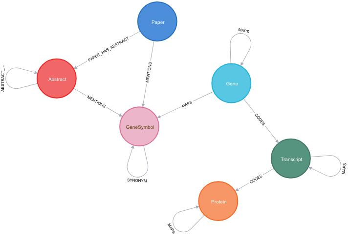

# We build a knowledge graph on Covid-19

- [What we do](#what-we-do)
- [Who we are](#who-we-are)
- [How to help](#how-to-help)
- [Get in touch](#get-in-touch)
- [Data](#data)
- [Use cases](#use-cases)
	- [Merge case and population data](#Cross-reference-case-data-and-population-data)

# What we do
We build a knowledge graph on Covid-19 that integrates various [public datasets](#data). This includes relevant publications, case statistics, genes and functions, molecular data and much more.

The graph is implemented in Neo4j and a public version is accessible at:

- https://covid.petesis.com:7473
- http://covid.petesis.com:7474/ (for Chrome/ium and other cases where there is a problem with SSL)
- user: public, password: corona

**Note: There is an issue with Chrome/Chromium and SSL. Use Firefox/Safari. We are working on a solution.**

The schema of the graph can be seen, [here](https://www.yworks.com/yed-live/?file=https://gist.githubusercontent.com/yGuy/27c2412bbf0724464c396fe2dc2a6851/raw/1bbd411619478ba1d500cea079de4d25ce947707/CovidGraphSchemaCleaned). 



# Who we are

We are a diverse team of scientists, developers and data people from academia and industry. We are from [Kaiser & Preusse](https://kaiser-preusse.com), [yWorks](https://www.yworks.com/), [Prodyna](https://www.prodyna.com/en/), [Neo4j](https://neo4j.com/), [German Center for Diabetes Research](https://www.dzd-ev.de/en/index.html), [University of Freiburg](https://www.uni-freiburg.de/?set_language=en), [Structr](https://structr.com) and more to come!

-----------------------


 
**Martin Preusse** ([martinpreusse.com](https://martinpreusse.com)), PhD in computational biology, Neo4j expert, Founder of [Kaiser & Preusse](https://kaiser-preusse.com).

 
 
 
**Sebastian Mueller** ([GitHub/yGuy](https://github.com/yguy)), working at [yWorks](https://yworks.com) on custom visualization solutions with [yFiles](https://www.yworks.com/yfiles). In this project, Sebastian is working on a prototype application for conveniently browsing the network of Covid19-related papers and publications.


**Tim Bleimehl** ([github/motey](https://github.com/motey)), working at [German Center for Diabetes Research](https://www.dzd-ev.de/en/index.html) as IT-cook-general. In this project Tim is working on the ETL pipeline for the CORD-19 Dataset.


**Dr. Alexander Jarasch**, bioinformatician, data head of data & knowledge management at [German Center for Diabetes Research](https://www.dzd-ev.de/en/index.html), working with graph technology. In this project he connects scientists from basic and clinical research with our Covid-19 knwoledge graph.


**Darko Križić** is founding member of [PRODYNA](https://www.prodyna.com/en/management). In his position as Chief Technical Officer, he constitutes the bridge from Software Development to highly available operation of critical applications to strategic management consultancy. 


**Dr. Juliane Zimmermann**, PhD in Biophysics, Requirements Engineer and Test Specialist at [Qnit](https://www.qnit.de/en/). In this project, 
she supports in determining relevant use cases and mediating between developers and scientists.


**Axel Morgner** is founder and CEO of [Structr](https://structr.com/?locale=en) and builds a website for CovidGraph.


# How to help

We need your help to learn more about Covid-19! You can help with:

- data analysis on the integrated data set
- load more datasets to Neo4j
- improve our website
- communicate and share our project

# Get in touch

We use [Matrix](https://matrix.org/) to communicate. It's a free and federated Slack. [Riot](https://about.riot.im/) is the standard client for Matrix.

How to get started:

- Download Riot or start the web app: [https://about.riot.im/downloads](https://about.riot.im/downloads)
- When asked to login/signup: create a free account on the matrix.org homeserver
- Contact `@mpreusse:matrix.org` on Riot!

(If this does not work you can contact us by email: `martin.preusse@gmail.com`)


# Data

We integrate data from various sources and link them in our knowledge graph:

1. Publication data set on Covid-19 ([https://pages.semanticscholar.org/coronavirus-research)](https://pages.semanticscholar.org/coronavirus-research))
2. Patents related to Covid-19 ([https://about.lens.org/covid-19/](https://about.lens.org/covid-19/))
3. Data on genes and their function (e.g. from [ENSEMBL](http://www.ensembl.org), [NCBI Gene](https://www.ncbi.nlm.nih.gov/gene) and [Gene Ontology](http://geneontology.org/))
4. Experimental data from clinical studies and molecular genetics
5. Case reports from John Hopkins University ([https://github.com/CSSEGISandData/COVID-19](https://github.com/CSSEGISandData/COVID-19))
6. Population data from the UN ([https://population.un.org/wpp/](https://population.un.org/wpp/))


## 1. Publication data set on Covid-19

([https://pages.semanticscholar.org/coronavirus-research)](https://pages.semanticscholar.org/coronavirus-research))

## 2. Patents related to Covid-19

([https://about.lens.org/covid-19/](https://about.lens.org/covid-19/))

## 3. Data on genes and their function

Data on genes and their function (e.g. from [ENSEMBL](http://www.ensembl.org), [NCBI Gene](https://www.ncbi.nlm.nih.gov/gene) and [Gene Ontology](http://geneontology.org/))

## 4. Experimental data from clinical studies and molecular genetics

## 5. Case reports from John Hopkins University 

John Hopkins University (JHU) aggregates data from WHO and other health organizations in a daily report. It contains the number of confirmed cases, deaths and recovered patients.

Dashboard: https://coronavirus.jhu.edu/map.html
Data: https://github.com/CSSEGISandData/COVID-19

## 6. Population data from the UN

The UN gathers data on world population statistics and publishes the world population prospects: https://population.un.org/wpp/

The latest data set in CSV format can be found here: https://population.un.org/wpp/Download/Standard/CSV/


# Use cases

## Cross reference case data and population data

### Datamodel 


### Queries

Confirmed/death/recovered per country

```cypher
MATCH (c:Country)<-[:PART_OF]-(p:Province)-[:REPORTED]->(u:DailyReport:Latest)
WHERE c.name = 'China'
RETURN c.name, sum(u.confirmed)
```

Confirmed cases for one country (percentage of the total population)

```cypher
MATCH (c:Country)-[r:CURRENT_TOTAL]->(:AgeGroup)
WHERE c.name = 'China'
WITH c, sum(r.count) AS total_population
MATCH (c)<-[:PART_OF]-(:Province)-[:REPORTED]->(u:DailyReport:Latest)
WITH c.name AS Country, sum(u.confirmed) as Confirmed, max(u.date) AS Update, total_population AS Population
RETURN Country, Population, Confirmed, (toFloat(Confirmed)/Population)*100 AS percent
```


Confirmed cases per country (percentage of the total population)

```cypher
MATCH (c:Country)-[r:CURRENT_TOTAL]->(:AgeGroup)
WITH c, sum(r.count) AS total_population
MATCH (c)<-[:PART_OF]-(:Province)-[:REPORTED]->(u:DailyReport:Latest)
WITH c.name AS Country, sum(u.confirmed) as Confirmed, max(u.date) AS Update, total_population AS Population
RETURN Country, Population, Confirmed, (toFloat(Confirmed)/Population)*100 AS percent ORDER BY percent DESC
```

Confirmed cases (total and percentage) for all entries for a country (one row for each province, many rows for China) -> query works only for countries that have **only one province**

```cypher
MATCH (c:Country)-[r:CURRENT_TOTAL]->(:AgeGroup)
WHERE c.name = 'Germany'
WITH c, sum(r.count) AS population
MATCH (c)<-[:PART_OF]-(p:Province)-[:REPORTED]->(u:DailyReport)
RETURN DISTINCT c.name, p.name, u.date, population, u.confirmed, (toFloat(u.confirmed)/population)*100 AS percent ORDER BY u.date DESC LIMIT 10
```

Timeline of confirmed cases by country (aggregated over all provinces)

```cypher
MATCH (c:Country)<-[:PART_OF]-(:Province)-[:REPORTED]->(u:DailyReport)
WHERE c.name = 'China'
WITH DISTINCT [u.date.year, u.date.month, u.date.day] AS date, sum(u.confirmed) AS sum
RETURN date, sum ORDER BY date
```

- problem: not every province for China is reported every day, thus the sum of all confirmed cases on data e.g. 18.03. does not equal the total nunber of confirmed cases at that date (because province X did report last on 17.03.) 

Number of people older than 70 in a country

```cypher
match (c:Country)-[r:CURRENT_TOTAL]-(ag:AgeGroup)
WHERE c.name = 'Germany' AND ag.start >= 70
RETURN sum(r.count)
```


